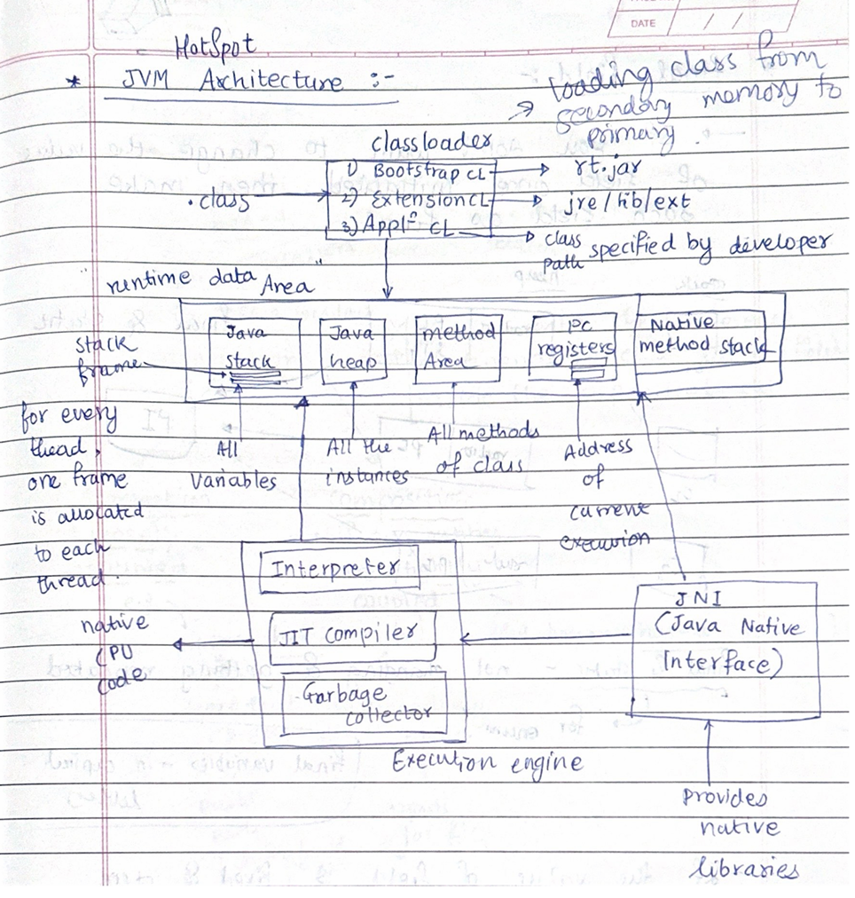

# Core Java Notes
---
## JVM (Java Runtime Environment) 

- **JVM HotSpot Architecture** 

# JVM Options

## Standard Options
- **-cp or -classpath**: Specifies the class path.
- **-D<name>=<value>**: Sets a system property.
- **-verbose**: Enables verbose output.
- **-version**: Displays the version information.
- **-showversion**: Displays version information and continues execution.
- **-server**: Selects the server JVM.
- **-client**: Selects the client JVM.

## Non-standard Options (-X options)
- **-Xms<size>**: Sets the initial heap size.
- **-Xmx<size>**: Sets the maximum heap size.
- **-Xss<size>**: Sets the stack size for each thread.
- **-Xmn<size>**: Sets the size of the young generation.
- **-Xloggc:<file>**: Logs GC status to a file.
- **-Xint**: Runs the JVM in interpreted-only mode.
- **-Xcomp**: Runs the JVM in compile-only mode.
- **-Xbatch**: Disables background compilation.
- **-Xprof**: Outputs CPU profiling data.

## Advanced Options (-XX options)
- **-XX:InitialHeapSize=<size>**: Sets the initial heap size.
- **-XX:MaxHeapSize=<size>**: Sets the maximum heap size.
- **-XX:NewSize=<size>**: Sets the initial size of the young generation.
- **-XX:MaxNewSize=<size>**: Sets the maximum size of the young generation.
- **-XX:PermSize=<size>**: Sets the initial size of the permanent generation.
- **-XX:MaxPermSize=<size>**: Sets the maximum size of the permanent generation.
- **-XX:SurvivorRatio=<ratio>**: Sets the ratio between Eden and survivor spaces.
- **-XX:NewRatio=<ratio>**: Sets the ratio between the young and old generation sizes.
- **-XX:MaxTenuringThreshold=<threshold>**: Sets the maximum tenuring threshold.
- **-XX:ParallelGCThreads=<threads>**: Sets the number of threads used for parallel GC.
- **-XX:+UseParallelGC**: Enables the parallel garbage collector.
- **-XX:+UseConcMarkSweepGC**: Enables the concurrent mark-sweep (CMS) garbage collector.
- **-XX:+UseG1GC**: Enables the G1 garbage collector.
- **-XX:InitiatingHeapOccupancyPercent=<percent>**: Sets the heap occupancy threshold for triggering a GC.
- **-XX:+PrintGC**: Prints GC details.
- **-XX:+PrintGCDetails**: Prints detailed GC information.
- **-XX:+PrintGCTimeStamps**: Prints timestamps at GC events.


- **JVM Tuning Parameters**

Command to add parameters: 
```bash
java -Xms512m -Xmx1024m -jar myapp.jar
java -Xms0.5g -Xmx1g -jar myapp.jar
```

JVM tuning involves adjusting parameters to optimize 
1. **Performance**
    - JIT Compiler Parameters:
        - `-XX:CompileThreshold=n`: Number of method invocations/loops before compilation.
        - `-XX:+AggressiveOpts`: Enable aggressive performance optimizations.
    - Thread Management:
        - `-XX:+UseThreadPriorities`: Enable thread priorities.
        - `-XX:ThreadStackSize=size`: Set the thread stack size.
2. **Memory Management**
    - **Heap Size Parameters:**
        - `-Xms<size>`: Sets the initial heap size.
        - `-Xmx<size>`: Sets the maximum heap size.
    - **New Generation Size Parameters:**
        - `-Xmn<size>`: Sets the size of the young generation.
        - `-XX:NewRatio=n`: Ratio between the old and new generation sizes.
        - `-XX:SurvivorRatio=n`: Ratio between Eden space and Survivor spaces in the young generation.
    - **Metaspace Parameters (for Java 8 and later)**:
        - `-XX:MetaspaceSize=size`: Initial size of the Metaspace.
        - `-XX:MaxMetaspaceSize=size`: Maximum size of the Metaspace
3. **Garbage Collection**
    - **Selecting a Garbage Collector:**
        - `-XX:+UseSerialGC`: Use the serial garbage collector.
        - `-XX:+UseParallelGC`: Use the parallel garbage collector (default for many JVMs).
        - `-XX:+UseConcMarkSweepGC`: Use the concurrent mark-sweep (CMS) garbage collector.
        - `-XX:+UseG1GC`: Use the G1 garbage collector.
   
    - **Garbage Collection Tuning:**
        - `-XX:ParallelGCThreads=n`: Number of threads for parallel garbage collection.
        - `-XX:ConcGCThreads=n`: Number of threads for concurrent garbage collection.
        - `-XX:MaxGCPauseMillis=ms`: Max pause time for garbage collection.
        - `-XX:GCTimeRatio=n`: Ratio of time spent in garbage collection versus application time

## Interview Questions on JVM:
[https://www.javamadesoeasy.com/2017/03/top-30-jvmjava-virtual-machine.html]

- You can resolve “java.lang.OutOfMemoryError : unable to create new native Thread” by setting the appropriate size using -Xss vm option. 
    - Solution 1 to “java.lang.OutOfMemoryError : unable to create new native Thread”  >
    Try to increase the the -Xss value so that new threads gets enough stack space.

    - Solution 2 to “java.lang.OutOfMemoryError : unable to create new native Thread”  >
    Alternatively you could also increase the heap size available using -Xms and -Xmx options and then try to increase and set appropriate -Xss value.
